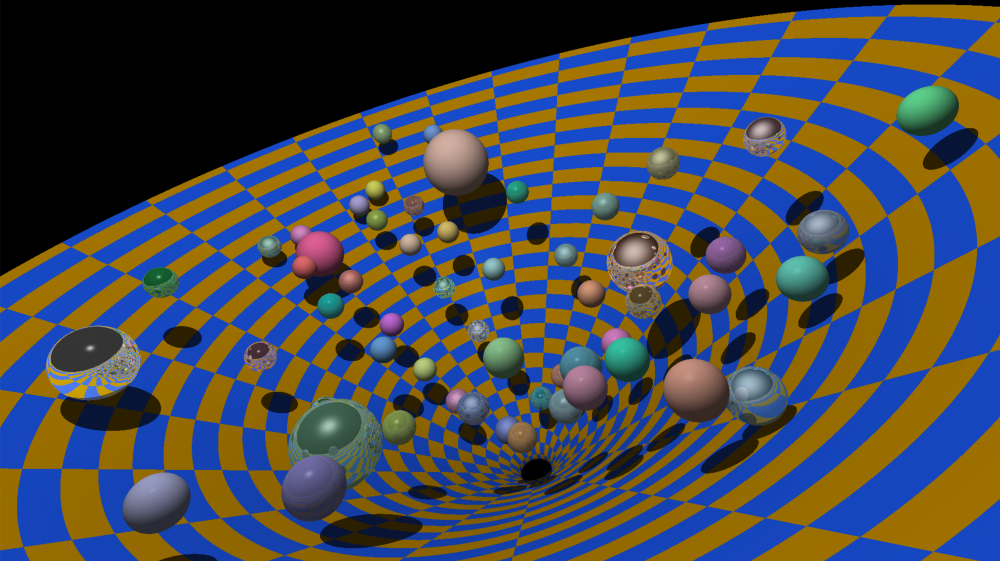
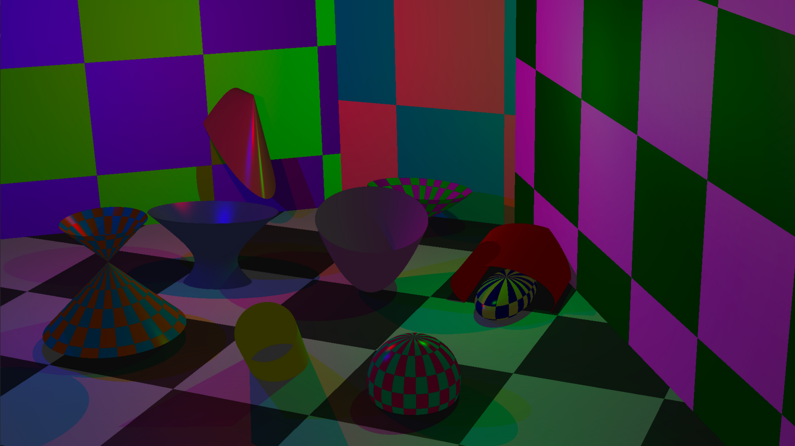
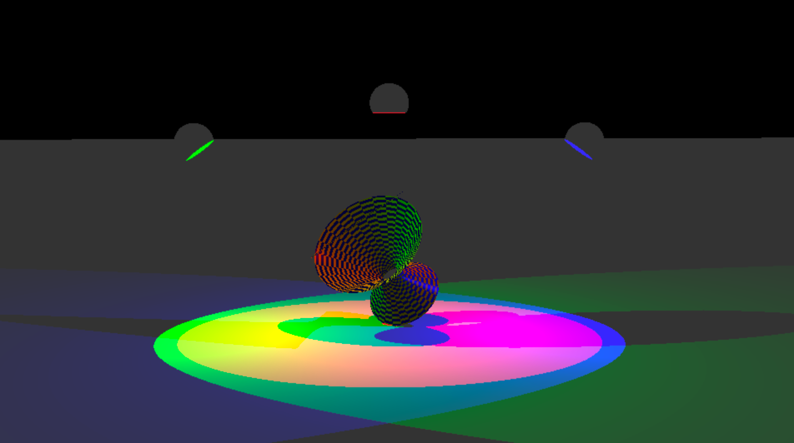

# mini Ray Traicing

  </img>
  </img>
  </img>
  </img>
  </img>
  </img>

# Implementation

- Phong reflection model
- image mapping
- nomal map
- Color disruption : checkerboard
- mirror 
- multi threading : 4

